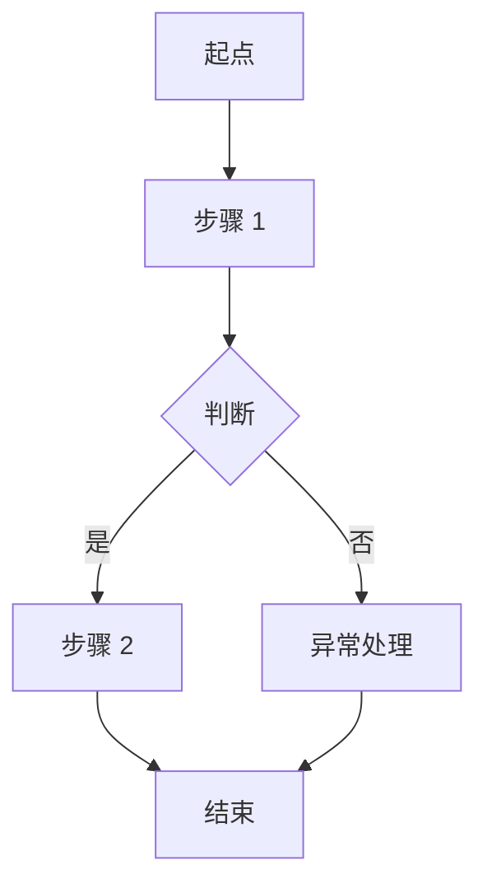
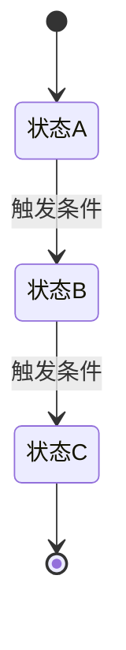

# {产品/功能名称} — 产品需求文档

> **版本**：v1.0 | **日期**：YYYY-MM-DD | **作者**：{作者}

---

## 一句话说清楚

{用一句话描述这个产品/功能是什么、给谁用、解决什么问题。不超过 50 字。}

---

## 1. 背景与问题

### 现状是什么

{描述当前的状况。用户现在怎么做这件事？痛点在哪？}

### 为什么现在要做

{什么触发了这个需求？是用户反馈、数据指标、业务战略，还是技术债？}

---

## 2. 目标

### 做成什么样

{明确要达到的效果。用具体的、可衡量的方式描述。}

- 目标 1：{...}
- 目标 2：{...}

### 怎么衡量成功

| 指标 | 当前值 | 目标值 | 说明 |
|------|--------|--------|------|
| {如：任务完成率} | {如：60%} | {如：85%} | {怎么算的} |

### 不做什么

{明确列出本次不包含的内容，避免范围蔓延。}

- 不做：{...}
- 不做：{...}

---

## 3. 用户与场景

### 目标用户

| 用户角色 | 特征描述 | 核心诉求 |
|----------|----------|----------|
| {如：运营人员} | {如：每天处理 200+ 工单} | {如：快速批量处理，减少重复操作} |

### 核心使用场景

{用简短的叙事描述用户的典型使用场景。不用写成用户故事格式，像讲故事一样把场景说清楚就行。}

**场景 1：{场景名}**
> {谁}在{什么情况下}，需要{做什么事}，目前{碰到什么问题}，期望{达到什么效果}。

**场景 2：{场景名}**
> ...

---

## 4. 整体流程

{用一段话概括主流程，然后画一张 Mermaid 流程图。}



{如果存在明确的状态流转对象（如订单、工单、审批），补一张状态图：}



---

## 5. 需求详述

{按流程顺序，逐个描述功能需求。每个需求是一个独立的块，包含完整的上下文。}

### 5.1 {需求名称}

**做什么**：{一句话描述这个需求}

**业务规则**：
1. {规则 1}
2. {规则 2}
3. {规则 3}

**用户操作流程**：
1. 用户{做什么}
2. 系统{反馈什么}
3. 用户{下一步}
4. ...

**异常与边界**：
| 异常情况 | 系统行为 | 用户看到什么 |
|----------|----------|------------|
| {如：网络超时} | {如：重试 1 次} | {如：提示"网络异常，请重试"} |
| {如：数据为空} | {如：展示空状态} | {如：显示"暂无数据"+ 引导操作} |

**页面布局**：（涉及 UI 时必填）
```text
+------------------------------------------+
| {页面标题}                                |
+------------------------------------------+
| {布局描述}                                |
|                                          |
| {用 ASCII 字符画出大致布局}                |
|                                          |
+------------------------------------------+
```

**验收标准**：
- [ ] {场景描述} → {预期结果}
- [ ] {场景描述} → {预期结果}
- [ ] {异常场景} → {预期结果}

---

### 5.2 {下一个需求}

...

---

## 6. 开放问题与风险

{诚实列出还没想清楚的事、需要其他团队确认的事、可能的风险。}

| # | 问题/风险 | 影响 | 当前状态 | 负责人 |
|---|----------|------|---------|--------|
| 1 | {如：第三方接口限流策略未确认} | {如：可能影响批量处理性能} | 待确认 | {谁} |
| 2 | {如：历史数据迁移方案} | {如：上线前需完成} | 讨论中 | {谁} |

---

## 附录

{放不进正文但有参考价值的内容：竞品截图、数据分析、会议纪要链接等。}
