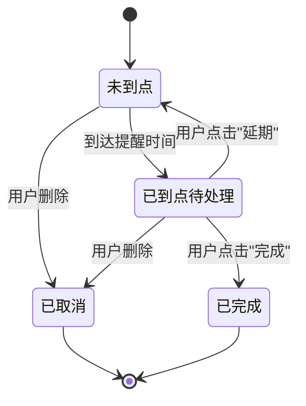
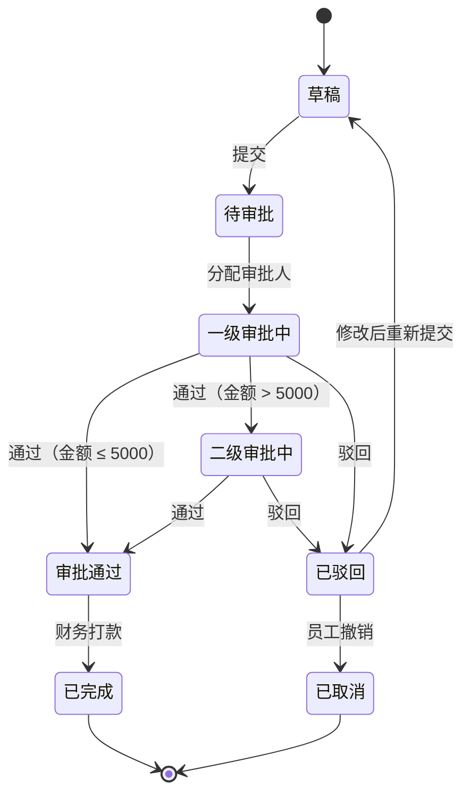
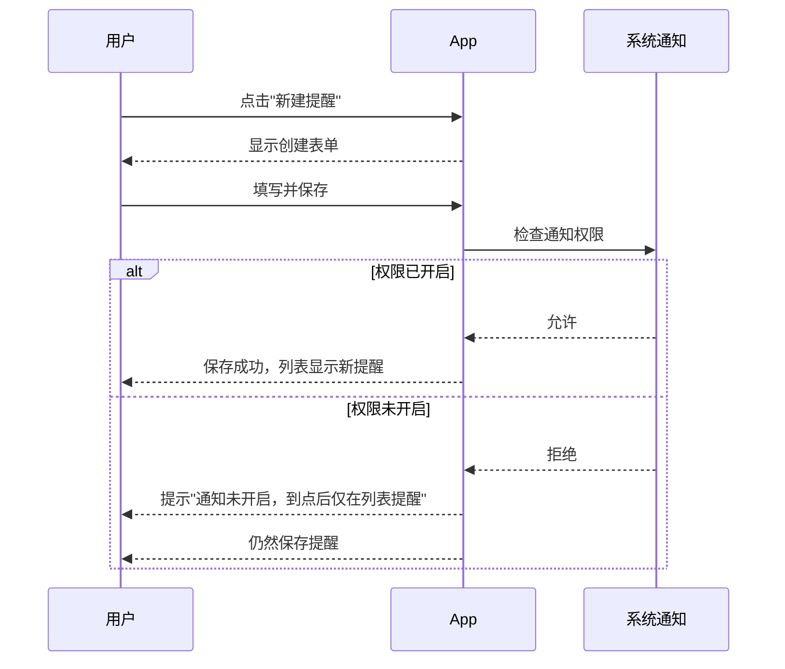
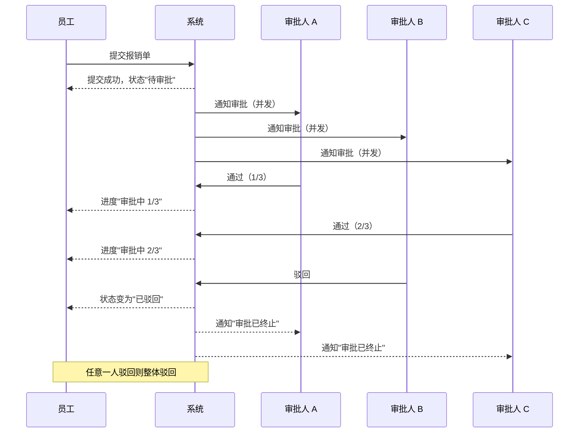

# Mermaid 图示例

> 用图把"流程怎么走、状态怎么变、谁和谁交互"讲清楚。
>
> **原则**：站在用户和业务的角度画，不要写 API 路径、数据库字段、HTTP 状态码这些技术细节。
>
> **复杂度控制**：单张图不超过 15-20 个节点。流程太复杂就拆成多张图，比按阶段分。

---

## 流程图（Flowchart）

适合描述：用户操作流程、业务审批流程、系统处理逻辑的关键分支。

### 示例：手机端"新建提醒"流程

```mermaid
flowchart TD
  A[进入提醒列表] --> B{列表是否为空?}
  B -->|是| C[展示空态 + 引导按钮]
  B -->|否| D[展示提醒列表]

  C --> E[点击"新建提醒"]
  D --> E

  E --> F[填写标题 + 时间]
  F --> G[点击"保存"]
  G --> H[返回列表，显示新提醒]

  H --> I{到达提醒时间?}
  I -->|是| J[触发通知]
  J --> K{用户选择}
  K -->|完成| L[标记已完成]
  K -->|延期| M[重新安排时间]
  K -->|关闭| N[保留为待处理]
```

### 示例：报销审批流程（含驳回）

```mermaid
flowchart TD
  A[填写报销信息] --> B[提交审批]
  B --> C{校验通过?}
  C -->|否| D[显示错误提示]
  D --> A

  C -->|是| E[状态变为"待审批"，通知审批人]
  E --> F{一级审批}
  F -->|通过| G{金额 > 5000?}
  F -->|驳回| H[通知员工 + 显示驳回理由]
  H --> A

  G -->|否| I[审批通过，通知员工]
  G -->|是| J[流转二级审批]
  J --> K{二级审批}
  K -->|通过| I
  K -->|驳回| H

  I --> L[财务打款，状态变为"已完成"]
```

---

## 状态图（State Diagram）

适合描述：有明确生命周期的对象，比如订单、工单、审批单、任务。

### 示例：提醒状态流转



### 示例：报销单状态流转



---

## 时序图（Sequence Diagram）

适合描述：多方交互、并发、超时等影响用户可见结果的场景。**不是每个需求都需要时序图**，只在"谁先谁后"对理解需求很重要时才画。

### 示例：创建提醒时的权限降级



### 示例：多人会签审批（并发）


